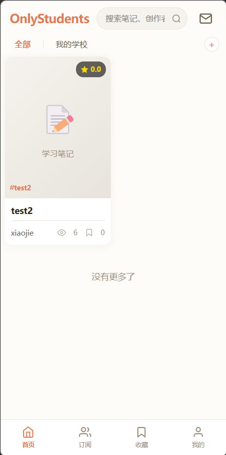
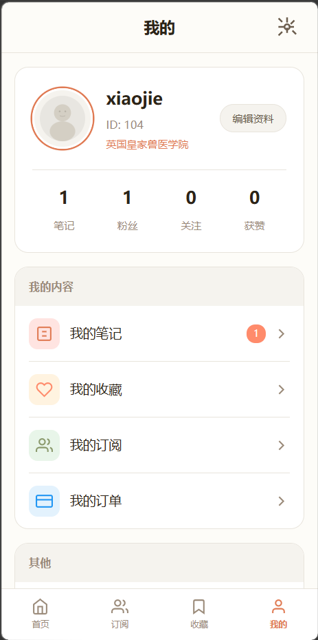
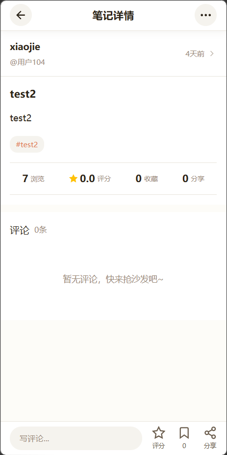
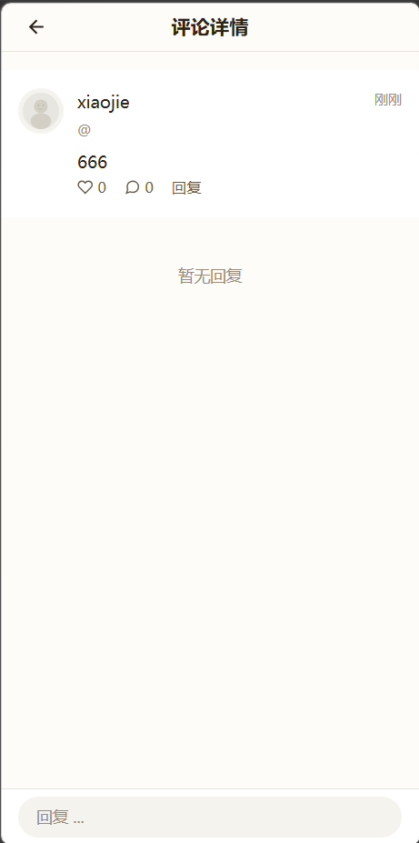
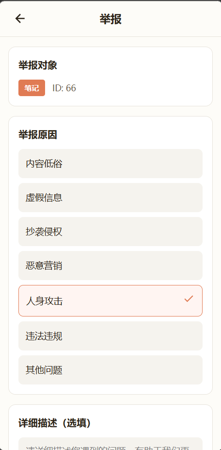
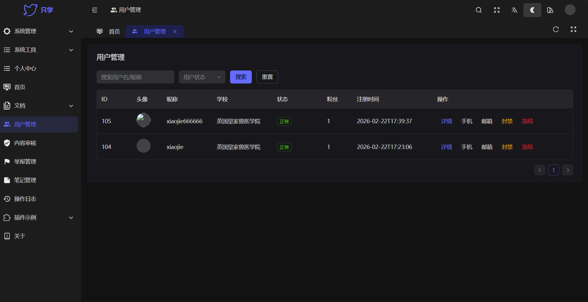
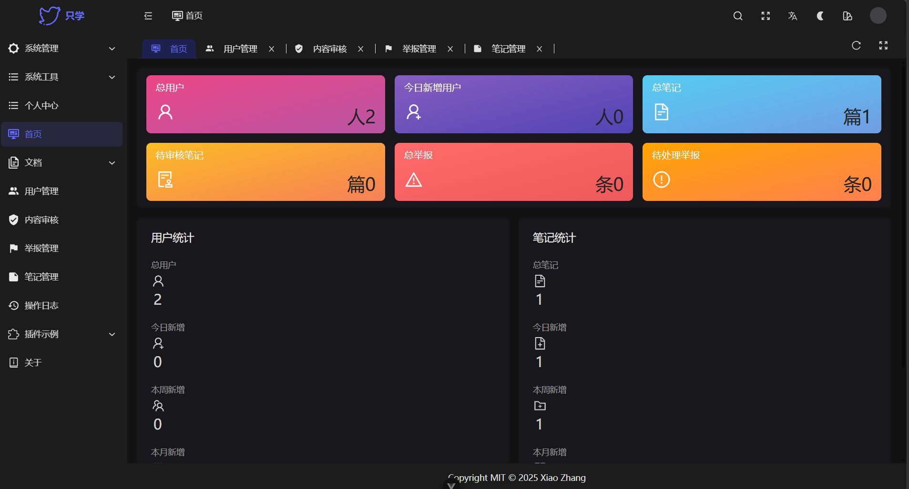

# OnlyStudents 学习笔记分享平台

<p align="center">
  
  
  
</p>

> 一个学习笔记分享平台，支持订阅、支付、实时通知等功能

## 📱 项目预览

### 用户端

| 首页                         | 创作者主页                        | 笔记详情                          |
|----------------------------|------------------------------|-------------------------------|
|  |  |  |

| 消息                       | 数据中心                         | 举报                         |
|----------------------------|------------------------------|----------------------------|
|  |  |  |

### 管理后台





## 📚 项目简介

OnlyStudents 是一个全栈微服务架构的学习笔记分享平台，提供以下核心功能：

- **用户系统** - 多方式注册登录（JWT认证）
- **笔记系统** - 发布、编辑、热度算法、权限控制
- **订阅系统** - 创作者订阅、付费内容
- **支付系统** - 钱包、充值、提现
- **评论系统** - 楼中楼回复、点赞
- **评分系统** - 收藏、分享、评分
- **消息系统** - 实时私信（WebSocket）
- **通知系统** - 实时通知（SSE + RabbitMQ）
- **搜索系统** - 全文搜索（Elasticsearch）
- **举报系统** - 内容审核
- **数据分析** - 运营数据统计

## 🏗️ 系统架构

```
┌─────────────────────────────────────────────────────────┐
│                    前端 (Vue3 + uni-app)                 │
└───────────────────────┬─────────────────────────────────┘
                        │
┌───────────────────────▼─────────────────────────────────┐
│                   API Gateway (8080)                     │
│              JWT认证 | 限流 | 路由转发                    │
└───────────────────────┬─────────────────────────────────┘
                        │
    ┌───────────┬───────┴───────┬───────────┐
    │           │               │           │
┌───▼───┐   ┌──▼───┐    ┌────▼────┐  ┌──▼───┐
│ 用户   │   │ 笔记  │    │  通知    │  │ 搜索  │
│ 服务   │   │ 服务  │    │  服务    │  │ 服务  │
│(8001) │   │(8003) │    │ (8009)  │  │(8012)│
└───────┘   └───────┘    └─────────┘  └───────┘
    │           │               │
    └───────────┴───────┬───────┘
                        │
┌───────────────────────▼─────────────────────────────────┐
│                   基础设施层                             │
│  MySQL 8  │  Redis 7  │  RabbitMQ  │  Elasticsearch  │
└─────────────────────────────────────────────────────────┘
```

## 🚀 快速开始

### 环境要求

- **Java**: 17+
- **Node.js**: 18+
- **MySQL**: 8.0+
- **Redis**: 7.0+
- **RabbitMQ**: 3.8+
- **Elasticsearch**: 7.x
- **Nacos**: 2.3+
- **MinIO**: 最新版

### 启动后端服务

```bash
# 1. 启动基础设施（Docker）
cd D:\Project\env
docker-compose up -d

# 2. 初始化数据库
mysql -u root -p < sql/init/01-init-databases.sql

# 3. 打包项目
mvn clean package -DskipTests

# 4. 启动服务（双击 start-services.bat 或手动启动）
java -jar user-service/target/user-service.jar
java -jar note-service/target/note-service.jar
# ... 其他服务
```

### 启动前端

```bash
# 安装依赖
cd D:\Project\java_project\only-students-frontend
npm install

# 启动开发服务器
npm run dev
```

## 📁 项目结构

```
only-students/
├── only-students-parent/          # 父POM，版本管理
├── only-students-common/         # 公共模块（工具类、实体、事件）
├── only-students-gateway/       # API网关 (8080)
├── user-service/               # 用户服务 (8001)
├── file-service/               # 文件服务 (8002)
├── note-service/               # 笔记服务 (8003)
├── subscription-service/       # 订阅服务 (8004)
├── payment-service/            # 支付服务 (8005)
├── comment-service/            # 评论服务 (8006)
├── rating-service/             # 评分服务 (8007)
├── message-service/            # 消息服务 (8008)
├── notification-service/        # 通知服务 (8009)
├── report-service/             # 举报服务 (8010)
├── withdrawal-service/         # 提现服务 (8011)
├── search-service/             # 搜索服务 (8012)
├── analytics-service/          # 分析服务 (8013)
├── admin-service/              # 后台服务 (8014)
├── only-students-frontend/     # 前端项目
└── sql/                        # 数据库脚本
```

## 🔧 技术栈

### 后端

| 技术            | 版本       |
|---------------|----------|
| Spring Boot   | 3.2.0    |
| Spring Cloud  | 2023.0.0 |
| MyBatis Plus  | 3.5.7    |
| MySQL         | 8.0      |
| Redis         | 7.0      |
| RabbitMQ      | 3.8.5    |
| Elasticsearch | 7.17     |
| Nacos         | 2.3      |

### 前端

| 技术      | 版本  |
|---------|-----|
| Vue     | 3.3 |
| uni-app | -   |
| Vite    | -   |
| Pinia   | -   |

## 📱 API 文档

启动服务后访问：

- **Gateway**: http://localhost:8080
- **Knife4j**: http://localhost:8080/doc.html

### 示例接口

```bash
# 用户注册
POST /api/user/register

# 用户登录
POST /api/user/login

# 创建笔记
POST /api/note/create

# 搜索笔记
GET /api/search/notes?keyword=数学&page=1&size=20

# 订阅创作者
POST /api/subscription/subscribe
```

## 🎯 核心功能

### 通知系统（事件驱动）

```
用户操作 → 源服务发布事件 → RabbitMQ → 通知服务监听 → 存储通知 → SSE推送
```

- **评论通知** - 评论笔记时通知作者
- **收藏通知** - 收藏笔记时通知作者
- **粉丝通知** - 关注时通知创作者
- **私信通知** - 发送私信时通知

### 实时消息

- **WebSocket** - 私信实时收发
- **SSE** - 通知未读数实时推送

### 热度算法

```
hotScore = viewCount * 1 + likeCount * 3 + favoriteCount * 5 + shareCount * 10
```

## 📊 数据库

| 服务                   | 数据库                       | 表数量 |
|----------------------|---------------------------|-----|
| user-service         | onlystudents_user         | 3   |
| note-service         | onlystudents_note         | 5   |
| file-service         | onlystudents_file         | 3   |
| subscription-service | onlystudents_subscription | 3   |
| payment-service      | onlystudents_payment      | 5   |
| comment-service      | onlystudents_comment      | 3   |
| rating-service       | onlystudents_rating       | 6   |
| message-service      | onlystudents_message      | 3   |
| notification-service | onlystudents_notification | 7   |
| search-service       | onlystudents_search       | 3   |
| report-service       | onlystudents_report       | 4   |
| withdrawal-service   | onlystudents_withdrawal   | 2   |
| analytics-service    | onlystudents_analytics    | 4   |
| admin-service        | onlystudents_admin        | 6   |

**总计**: 14个数据库，63张表

## 🔐 安全特性

- JWT Token 认证（HS256，24小时过期）
- 密码 BCrypt 加密存储
- Sentinel 接口限流
- SQL 注入防护（MyBatis 参数化）
- XSS 输入过滤

## 📈 性能优化

- Redis 热点数据缓存
- RabbitMQ 异步处理
- ES 全文检索
- 文件 MD5 秒传
- 连接池复用

## 🚦 部署

### 开发环境

直接启动所有服务或按需启动

### 生产环境（推荐）

```bash
# 使用 Docker Compose
cd D:\Project\env
docker-compose -f docker-compose.prod.yml up -d
```

## 📝 后续计划

- [ ] 接入真实支付（微信/支付宝）
- [ ] APP 推送集成
- [ ] CDN 静态资源加速
- [ ] 推荐算法
- [ ] AI 内容审核

## 📄 License

MIT License
